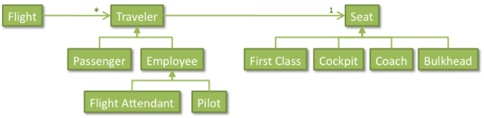

#### Project Description

Write a Java program using inheritance and string formatting.

#### Airline Flights

Airline flights take travelers around the world. Flights are flown by pilots and carry passengers. Passengers sit in coach or first class and are serviced by flight attendants. As a benefit to employees, airlines allow pilots and flight attendants to fly in coach or first class when they are not on duty. At any other time, pilots sit at the cockpit and flight attendants sit at the bulkhead seats, both of which are, of course, seats that no passenger is allowed to use. Flights cannot depart unless seats are filled to meet certain requirements. There must be two pilots in the cockpit, 8 or more passengers in coach or first class, and at least 1 flight attendant per 5 passengers.

To simulate this scenario, you are asked to program the classes below.

  

The figure above shows two class hierarchies: the *Traveler* hierarchy (with subclasses *Passenger*,*Employee*, *FlightAttendant* and *Pilot*), and the *Seat* hierarchy (with subclasses *FirstClass*, *Cockpit*, *Coach* and *Bulkhead*). The figure can be read as “Each flight has (0 or more) travelers, each of which has a seat.”  Remember that "has-a" implies a field, while subclasses use **extends**.

These classes aredescribed below. All fields must be defined “**private**”.

### Seat Hierarchy

* **Seat:** Each seat has a location (string) that is initialized with a given value in the constructor. This location can be retrieved using a gettermethod. In terms of equality, two seats are the same if they have the samelocation. Also, a “toString” method returns the seat’s location.
* **FirstClass:** Two first class seats are the same if they are first class seats with the same location (re-use its super-class method). “toString” returns a string “First Class” left aligned in 12 spaces, followed by its location right-aligned in 3 spaces and within square brackets. Re-use the super class’“toString”.
* **Coach:** Two coach seats are the same if they are coach seats with the same location. “toString” returns a string “Coach” left aligned in 12 spaces, followed by the seat’s location right-aligned in 3 spaces and within square brackets. Re-use the super class’ “toString” method.
* **Cockpit:** The location of cockpits is always “Cockpit”. Two cockpit seats are the same if they are cockpit seats (they have the same location by default). There is no need to override “toString”.
* **Bulkhead:** The location of bulkhead seat is always “Bulkhead”. Two bulkhead seats are the same if they are bulkhead seats (their location is the same by default). Do not override “toString”.

**Traveler Hierarchy**

* **Traveler:** Each traveler has a name (String) and a seat (Seat) both of which are initialized in a constructor, and can be retrieved using getter methods. Two travelers are the same if they have the same name. The “toString” description of a traveler is the name of the traveler left aligned in 20 spaces, followed by “ | ” (there is a blank space before and after the “|” character), followed by the traveler’s seat description (use its “toString” result).

* **Passenger: **Since passengers are travelers, they receive a name and a seat, but this seat cannot be in the cockpit or a bulkhead seat. In such cases, the constructor throws an “IllegalArgumentException” (which Java defines already). Two passengers are the same if (in addition to having the same name—reuse the super class implementation of equals) both are passengers.

* **Employee:** Employees are travelers that (in addition to a name and seat) receive a salary (double), which is also initialized in the constructor and is retrieved using a getter method. Two employees are the same if (in addition to their names) they are employees and have the same salary (re-use the inherited “equals” method). The “toString” description of an employee is the travelers description (re-use the inherited “toString” method), followed by “ | ” (thereis a blank space before and after the “|” character), followed by a “$” sign, followed by the employee’s salary right-aligned in 10 spaces, with commas, and 2 decimal places.

* **Pilot:** Two pilots are the same if (in addition to their name and salary)they are pilots.

* **FlightAttendant:** Two flight attendants are the same if (in addition to their name and salary) they are flight attendants.

**Flight:** The class“Flight” will have a name (string) and an array list to hold travelers. A constructor receives the name and initializes the list of travelers, and there is a getter method for the flight name. In addition it implements the following methods:

* **addTraveler: **It receives a passenger and adds it to the flight if the passenger is not in the flight already. The method returns a boolean indicating whether the traveler was added or not.
* **getTravelers:** It returns a new list with all the travelers in the flight (use shallow copy).
* **getPilots:** It returns a new list with the pilots (those sitting in the cockpit) in the flight (shallow copy).
* **getFlightAttendants:** It returns a new list with the flight attendants (in bulkhead seats; shallow copy).
* **getPassengers:** It returns a new list with the passengers (those in coach or first class; shallow copy).
* **canDepart:** It returns a boolean indicating whether the flight can depart—which it can do if there are at least 2 pilots in the cockpit, at least 8 passengers, and a ratio of 5 passengers (or less) per flight attendant.
* **toString:** It returns the description of a flight as a multi-line string listing the flight’s name, followed by a list of pilots, flight attendants and passengers. For example, the following is the printout of flight “CO 853” that has 1 pilot, 1 flight attendant and 5 passengers:

---

    FLIGHT: CO 853
    PILOTS:
    Roberto Benigni      | Cockpit | $ 26,199.56
    FLIGHT ATTENDANTS:
    Drew Barrymore       | Bulkhead | $ 35,679.25
    PASSENGERS:
    J.J. Abrams          | Coach       [18A] | $ 54,000.00
    Woody Allen          | First Class [ 5C] | $ 49,000.00
    Alfonso Arau         | First Class [ 3A]
    Dan Aykroyd          | First Class [ 3B]
    Ingmar Bergman       | Coach       [12C] | $ 12,300.00
    
---

To include an end-of-line within the string, just use “\n”.

Use the classes “FlightTest.java”, “SeatTest.java” and “TravelerTest.java” to test your implementation. These classes should not be modified. Your program should not hard-code its answers.

***Due Monday, November 14 at the end of the day***
